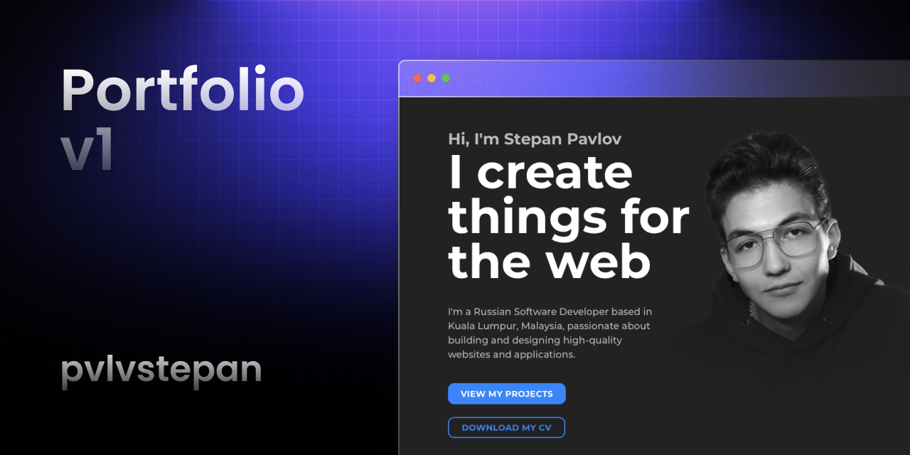

# Portfolio v1



[](https://github.com/pvlvstepan/portfolio-v1/actions/workflows/pages/pages-build-deployment)

First iteration of my portfolio. This is a place where everything about me, my projects and skills can be found. This website isn't just my portfolio, but also a personal project in and of itself. I think I've grown quite a bit as a developer & engineer, so I wanted to create something to showcase some of what I've learned and done.

## Installation

To run Portfolio v1 locally, follow these steps:

1. Clone the repository:

   ```bash
   git clone https://github.com/pvlvstepan/portfolio-v1.git
   cd portfolio-v1
   ```

2. Install dependencies (Node.js v12 or higher, but not higher than v16 is required):

   ```bash
   npm install
   ```

3. Start the development server:

   ```bash
   npm start
   ```

4. Open your web browser and navigate to `http://localhost:3000` to access the application.


## Technologies Used

- [React](https://github.com/facebook/react)
- [Node.js](https://github.com/nodejs/node)
- [Chakra-UI](https://github.com/chakra-ui/chakra-ui)
- [Framer Motion](https://www.framer.com/motion/)

## License

This project is licensed under the MIT License - see the [LICENSE](LICENSE) file for details.
